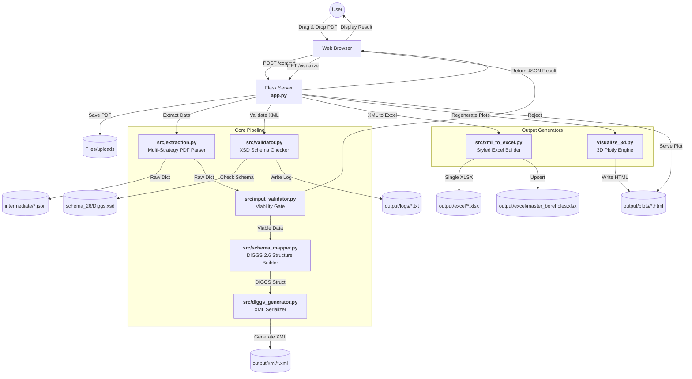
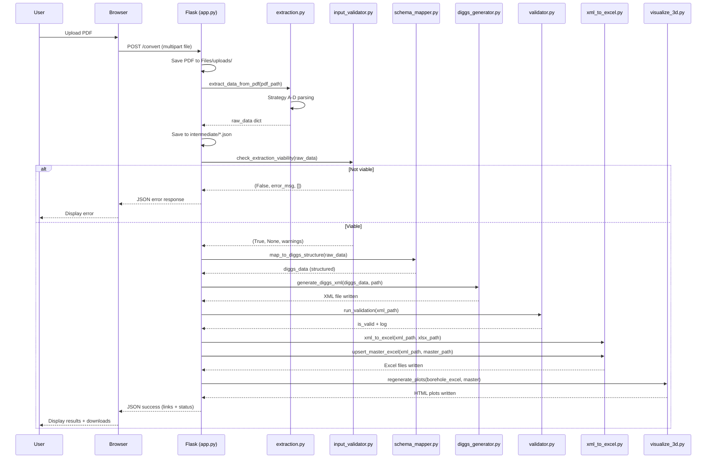

# System Architecture — PDF to DIGGS 2.6 Conversion Pipeline

This document provides a detailed technical overview of the system's architecture, data flow, and module responsibilities.

---

## High-Level Architecture

The system is a **six-stage linear pipeline** orchestrated by a Flask web server. Each stage is a self-contained Python module with a single responsibility, making the system easy to extend, test, and debug.

```
PDF Upload → Extraction → Input Validation → Schema Mapping → XML Generation → XSD Validation → Excel + 3D Viz
```

### Architecture Diagram



---

## Data Flow (Step by Step)

The following describes the complete journey of a PDF through the system:



---

## Module Breakdown

### 1. Flask Application (`app.py`)

**Role**: Web server and pipeline orchestrator.

- **Routes**:
  - `GET /` — Landing page
  - `GET /converter` — Drag-and-drop PDF upload UI
  - `POST /convert` — Triggers the full conversion pipeline
  - `GET /visualize` — 3D visualization viewer
  - `GET /plots/<plot_name>` — Serves pre-generated Plotly HTML via iframe
  - `GET /download/<filename>` — File download for XML and Excel outputs
  - `GET /download_master` — Download the master borehole Excel
  - `POST /reset` — Clears all processed data for a fresh start

- **Orchestration**: On `POST /convert`, the server chains all pipeline stages in order: Extract → Validate → Map → Generate → Validate XSD → Excel → Plots → Return JSON.

---

### 2. Data Extraction (`src/extraction.py`)

**Role**: Convert unstructured PDF content into structured Python dictionaries.

- **Library**: `pdfplumber` for reading the visual table layout of the PDF.
- **Multi-Strategy Approach** — Four extraction strategies run in combination:

| Strategy | Target | Approach |
|---|---|---|
| **A** — Depth/Elevation Columnar | Standard tabular logs with depth columns | Regex column identification + row parsing |
| **B** — Inline SPT Values | Logs with `N=XX` or `8-16-31` blow counts inline | Regex capture of SPT patterns within text |
| **C** — Structured Stratigraphy Cells | Depth/elevation pairs with soil descriptions | Regex parsing of `0.0 / 659.6 BROWN SILTY CLAY` format |
| **D** — VDOT Graphical Fallback | No structured stratigraphy; free-text descriptions | Falls back to N-value-driven soil classification |

- **Reversed Text Handling**: Detects and reverses mirrored column headers (e.g., `HTPED` → `DEPTH`) using a keyword dictionary.
- **Header Parsing**: Exhaustive regex patterns for metadata (Project Name, Borehole ID, Lat/Lon, Elevation, Date).
- **Output**: A dictionary with `metadata`, `stratigraphy` (list of layers), and `tests` (list of SPT entries).
- **Intermediate JSON**: The raw dictionary is saved to `intermediate/<filename>.json` for debugging and verification.

---

### 3. Input Validation (`src/input_validator.py`)

**Role**: Early rejection gate for non-borehole documents.

- **Gate 1 (Hard Stop)**: Both `tests` AND `stratigraphy` are empty → reject immediately with a descriptive error message. This prevents non-borehole PDFs from reaching the mapping step.
- **Gate 2 (Soft Warning)**: Borehole ID is `"Unknown"` but data exists → proceed with a warning that the user may wish to manually edit the label.
- **Design Rationale**: Output-driven validation — if there's no data to put in the XML, there's no reason to continue.

---

### 4. Schema Mapping (`src/schema_mapper.py`)

**Role**: Transform flat extracted data into the complex DIGGS 2.6 object hierarchy.

- **DIGGS Concepts Mapped**:
  - `Project` — Container for the investigation
  - `Borehole` — The specific sampling feature, linked to the Project
  - `SamplingActivity` — SPT test events linked to the Borehole
  - `LithologySystem` — Groups lithologic observations
  - `LithologyObservation` — Individual soil layers with depth ranges (`LinearExtent`) and descriptions (`Lithology`)

- **Internal Referencing**: Assigns UUIDs (`gml:id`) to every element to ensure valid cross-references (e.g., a Layer referencing its parent Borehole, a Test referencing its SamplingActivity).

---

### 5. XML Generation (`src/diggs_generator.py`)

**Role**: Serialize the mapped DIGGS objects into a valid `.xml` file.

- **Library**: `lxml` for robust namespace handling and XML construction.
- **Namespaces**: Correctly handles all required namespaces:
  - `xmlns:diggs` — DIGGS 2.6 namespace
  - `xmlns:gml` — GML 3.2 namespace
  - `xmlns:witsml` — WITSML namespace
  - `xmlns:xsi` — XML Schema Instance
- **Output**: Written to `output/xml/<filename>.xml`.

---

### 6. XSD Schema Validation (`src/validator.py`)

**Role**: Confirm the generated XML is fully DIGGS 2.6 compliant.

- Runs **immediately after XML generation**, before Excel or 3D plot steps.
- Validates against the official DIGGS 2.6 XSD schema (`schema_26/Diggs.xsd`) using `lxml.etree.XMLSchema`.
- Writes a detailed pass/fail report to `output/logs/<filename>_validation.txt`.
- The validation result and log content are included in the JSON response returned to the browser.

---

### 7. Excel Generation (`src/xml_to_excel.py`)

**Role**: Provide human-readable, tabular outputs of the converted data.

- Runs **after validation** so only schema-checked XML is converted.
- **Two outputs per conversion**:
  1. **Per-borehole Excel** (`output/excel/<filename>.xlsx`) — 2-sheet workbook:
     - *Sheet 1: Borehole Info* — Key-value metadata (Project, ID, GPS, Elevation, Date)
     - *Sheet 2: Stratigraphy & SPT* — Tabular layer data with soil-color-coded rows
  2. **Master Excel upsert** (`output/excel/master_boreholes.xlsx`) — Flat-table database of all processed boreholes. If a borehole already exists, its rows are replaced; new boreholes are appended.

- **Professional Styling**: Headers with dark fills, bold white text, thin borders, soil-type color-coded fills (Sand=#F4A460, Clay=#A0522D, etc.).

---

### 8. 3D Visualization (`visualize_3d.py`)

**Role**: Generate interactive 3D plots for spatial subsurface interpretation.

Runs **last**, after Excel generation, so the master Excel reflects the latest borehole data.

**Visualization Features**:

| View | Description |
|---|---|
| **3D Borehole Grid** | Stacked colored cylinder segments representing soil layers at each borehole location |
| **SPT N-Value Sidebar** | Vertical scatter profile showing SPT stiffness as horizontal offset from the borehole |
| **3D Cross-Section** | Ribbon panels connecting adjacent boreholes with linearly interpolated layer boundaries |
| **Volumetric Interpolation** | Isosurface volumes interpolated between 2+ boreholes using `scipy.interpolate.griddata` |

**Positioning**:
- **Phase 1**: Single borehole placed at origin (0, 0).
- **Phase 3**: Real GPS coordinates converted to local East/North feet using spherical Earth approximation.
- **Fallback**: Synthetic 100-ft grid if GPS coordinates are unavailable.

**Rendering**:
- Cylinders rendered as parameterized `Surface` traces (2×n_theta grid).
- Rich hover data: Borehole ID, soil type, USCS code, depth range, N-value.
- Dark theme with labeled axes (East ft / North ft / Elevation ft).

---

## Intermediate Representation

The intermediate JSON file (`intermediate/<filename>.json`) serves as a **decoupling layer** between the PDF format and the DIGGS XML schema:

```json
{
  "metadata": {
    "project_name": "Route 29 Widening",
    "borehole_id": "B-4",
    "latitude": 37.3682,
    "longitude": -78.8287,
    "elevation": 659.6,
    "date": "2023-10-15"
  },
  "stratigraphy": [
    {
      "start_depth": 0.0,
      "end_depth": 5.0,
      "description": "BROWN SILTY CLAY (CL)",
      "uscs_code": "CL"
    }
  ],
  "tests": [
    {
      "depth": 2.5,
      "n_value": 12,
      "blows": "4-5-7"
    }
  ]
}
```

**Benefit**: New PDF layouts can be supported by adding a new extraction strategy — the Schema Mapper, XML Generator, and all downstream modules remain unchanged.

---

## Directory Layout & Data Flow Mapping

```
Input:    Files/uploads/<pdf>       ← User-uploaded PDF
  │
  ├──►  intermediate/<name>.json   ← Raw extraction (debug / verify)
  ├──►  output/xml/<name>.xml      ← DIGGS 2.6 XML
  ├──►  output/logs/<name>_validation.txt  ← XSD validation report
  ├──►  output/excel/<name>.xlsx   ← Per-borehole Excel
  ├──►  output/excel/master_boreholes.xlsx ← Cumulative database
  └──►  output/plots/
           ├── borehole_grid.html  ← 3D cylinder view
           └── cross_section.html  ← 3D cross-section view
```

---

## Error Handling

The pipeline implements **fail-fast** error handling at every stage:

1. **Upload** — Rejects non-PDF files at the Flask route level.
2. **Extraction** — Catches `pdfplumber` exceptions; logs and returns a descriptive error.
3. **Input Validation** — Hard-stops on empty data; soft-warns on missing Borehole ID.
4. **XML Generation** — Catches `lxml` construction errors.
5. **XSD Validation** — Reports all schema violations (line numbers, element paths) in the validation log.
6. **Excel / Plots** — Graceful degradation: missing fields are left blank; zero-thickness layers are skipped.

---

## Future Extensibility

| Extension | Module to Modify | Impact on Pipeline |
|---|---|---|
| New PDF layouts (e.g., Terracon, Fugro) | `extraction.py` — add new strategy | None — downstream unchanged |
| New data types (Water Level, CPT, Lab Tests) | `schema_mapper.py` + `diggs_generator.py` | Additive — new XML elements |
| Batch PDF processing | `app.py` — loop `POST /convert` | None — pipeline is per-file |
| REST API for programmatic access | `app.py` — add `/api/convert` route | None — same pipeline logic |
| Cloud deployment (Docker) | Add `Dockerfile` + `docker-compose.yml` | None — app is self-contained |
