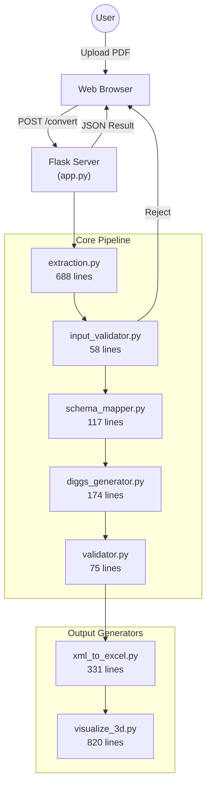
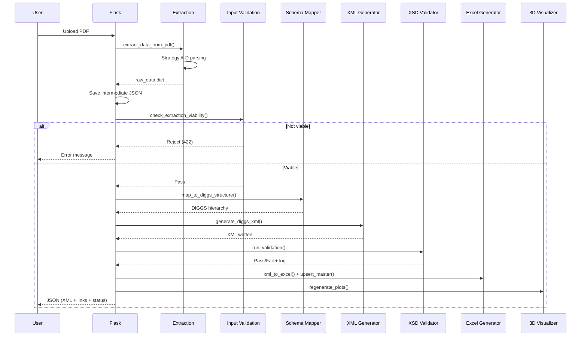
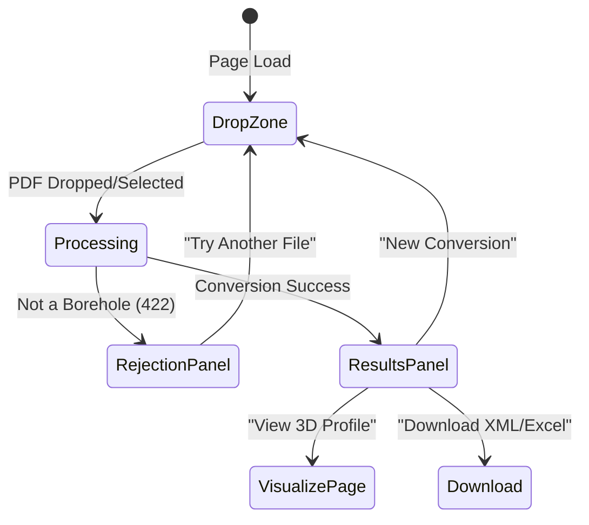

# DIGGS 2.6 Borehole Log Converter — Complete Project Report

**SUNY Polytechnic Institute — DIGGS Student Hackathon 2026**  
*Report generated: March 10, 2026*

---

## 1. Executive Summary

This project delivers an **end-to-end automated pipeline** that converts unstructured PDF borehole logs into validated, machine-readable outputs — DIGGS 2.6 XML, structured Excel workbooks, and interactive 3D soil-profile visualizations — all from a single drag-and-drop web interface.

The system was built to address a fundamental problem in geotechnical engineering: **site investigation data trapped in PDF documents** that resist automated analysis, cross-site comparison, and data sharing. Our solution eliminates manual data extraction by applying multi-strategy regex parsing to handle a wide variety of PDF layouts, including reversed-text headers, inline SPT values, and graphical log formats.

> [!IMPORTANT]
> **Key Achievement**: The pipeline produces DIGGS 2.6 schema-validated XML — every generated file is automatically checked against the official XSD schema, with pass/fail reports written to log files.

---

## 2. Problem Statement

Geotechnical site investigation data is routinely recorded as **PDF-format borehole logs** — unstructured, human-readable documents that:

- Cannot be searched, queried, or compared programmatically
- Require hours of manual data entry to digitize
- Use inconsistent formats across different firms and agencies
- Lock valuable subsurface data away from modern data-driven analysis

The **DIGGS (Data Interchange for Geotechnical and Geoenvironmental Specialists)** 2.6 XML standard exists precisely to solve this — but no tool existed to automatically convert legacy PDFs into DIGGS XML.

---

## 3. Solution Architecture

### 3.1 High-Level Pipeline

The system follows a **six-stage linear pipeline** with strict separation of concerns:

```
PDF Upload → Extraction → Validation → Schema Mapping → XML Generation → XSD Validation
                                                                              │
                                          ┌───────────────────────────────────┘
                                          ▼
                                    Excel Generation → 3D Visualization
```

### 3.2 Architecture Diagram



### 3.3 Data Flow Sequence



---

## 4. Module-by-Module Breakdown

### 4.1 Flask Application ([app.py](file:///c:/Users/DELL/Downloads/Diggs_Hackathon_Submission%20-%20Copy/app.py))

| Metric | Value |
|---|---|
| Lines of Code | 200 |
| Routes | 8 |
| Role | Web server & pipeline orchestrator |

**Routes**:

| Route | Method | Purpose |
|---|---|---|
| `/` | GET | Landing page with hero section and feature cards |
| `/converter` | GET | Drag-and-drop PDF upload interface |
| `/convert` | POST | Triggers the full conversion pipeline |
| `/visualize` | GET | 3D visualization viewer (dual iframe) |
| `/plot/<name>` | GET | Serves pre-generated Plotly HTML files |
| `/download/<file>` | GET | Download XML or Excel outputs |
| `/download-master` | GET | Download the cumulative master Excel |
| `/reset-master` | POST | Clear all processed data for fresh start |

**Key Design Decisions**:
- **32 MB upload limit** prevents server blocking on oversized files
- **`secure_filename`** sanitizes uploads to prevent path traversal attacks
- **`use_reloader=False`** prevents Flask auto-restart when output files are generated
- **Per-request file paths** avoid shared-file race conditions
- **Non-fatal Excel/plot errors** — Excel and visualization generation failures don't block the primary XML conversion

---

### 4.2 PDF Data Extraction ([src/extraction.py](file:///c:/Users/DELL/Downloads/Diggs_Hackathon_Submission%20-%20Copy/src/extraction.py))

| Metric | Value |
|---|---|
| Lines of Code | 688 |
| Functions | 12 |
| Role | Multi-strategy PDF parser — the most complex module |

This is the **heart of the system**. It handles the enormous variety of real-world borehole log formats.

#### Extraction Strategies

````carousel
**Strategy A — Columnar SPT (Depth + Blows columns)**

Targets standard tabular logs with identifiable depth and blow count columns.

```
How it works:
1. _identify_columns() scans the first 8 rows for keyword matches
2. Depth column keywords: DEPTH, HTPED (reversed)
3. Blows column keywords: BLOWS, SWOLB, N-VALUE
4. Parses newline-separated cell values (multi-entry per cell)
5. Skips elevation columns (values > 200)
6. Calls parse_spt_from_cells() for paired depth/blow parsing
```
<!-- slide -->
**Strategy B — Inline N=XX with Cross-Column Depth Lookup**

Targets logs with `N=47` or `8-16-31` formatted blow counts embedded in text cells.

```
How it works:
1. Scans every cell for _N_PATTERN: r"N\s*=\s*(\d+)"
2. Gets depths from depth_col in the same row, or ±2 nearby rows
3. Falls back to other cells in the same row
4. Infers depth intervals when partial data is available
5. SPT refusal format (50/2") → capped at N=50
```
<!-- slide -->
**Strategy C — Structured Stratigraphy Cells**

Targets logs with depth/elevation formatted soil descriptions.

```
Format A: "0.0 / 659.6  BROWN SILTY CLAY (CL)"
  → Parses depth, elevation, description, USCS code
  → Sorts by top depth, computes bottom = next layer's top

Format B: Inline description text (fallback)
  → Extracts descriptions from strat_col
  → Gets depths from depth_col in same row
  → Filters out noise (headers, metadata lines)
  → Bug fix: default 1.5ft thickness if top == bottom
```
<!-- slide -->
**Strategy D — VDOT Graphical Fallback (Free-Text)**

Targets VDOT-style logs where soil descriptions are floating text beside hatching symbols, not inside table cells.

```
Triggers when: Strategies A-C found 0 stratigraphy layers

How it works:
1. Scans all page words using pdfplumber.extract_words()
2. Groups words into lines by y-bucket (5pt tolerance)
3. Filters for soil keywords: SAND, SILT, CLAY, ROCK, FILL, etc.
4. Rejects header/metadata lines (PROJECT, BORING, etc.)
5. Extracts USCS codes (SM, CL, CH, etc.)
6. Assigns depth range from SPT test span
```
````

#### Metadata Extraction

Exhaustive regex pattern matching for:

| Field | Patterns | Example Matches |
|---|---|---|
| Project Name | 3 patterns | `PROJECT: Route 29`, `PROJ. No. 12345`, `JOB NAME: Bridge` |
| Borehole ID | 2 patterns | `LOG OF BORING NO. B-4`, `BH-1`, `TH-3`, `CPT-1` |
| Date | 5 patterns | `Date Drilled: 10/15/2023`, `DRILLING DATE: 2023-10-15` |
| Latitude | 3 patterns | `LATITUDE: 37.368`, `N 37.368°` |
| Longitude | 3 patterns | `LONGITUDE: -78.828`, `W 78.828°`, `, -98.652` |
| Elevation | 2 patterns | `ELEVATION: 659.6`, `ELEV. FT = 659.6` |
| Total Depth | 4 patterns | `DEPTH DRILLED: 50.5`, `Boring Terminated at 50.5 feet` |

**Special Handling**:
- **Reversed text detection**: Checks against a keyword dictionary (`HTPED` → `DEPTH`, `SWOLB` → `BLOWS`, etc.)
- **Filename coordinate fallback**: Extracts lat/lon from filenames like `37.368;-78.828.pdf`
- **Hemisphere correction**: Automatically negates longitude when `W` hemisphere indicator is present

#### SPT Parsing

| Format | Example | Result |
|---|---|---|
| Plain integer | `23` | N=23 |
| N=XX format | `N=47` | N=47 |
| Refusal | `50/2"` | N=50 |
| 3-set blow counts | `8-16-31` | N=47 (last two sets summed) |

#### Post-Processing

- **SPT Deduplication** (two-pass):
  1. Remove exact [(depth_top, n_value)](file:///c:/Users/DELL/Downloads/Diggs_Hackathon_Submission%20-%20Copy/app.py#35-38) duplicates
  2. Resolve Strategy A vs B conflicts by keeping highest N-value at each depth
- **Interval estimation**: Computes median SPT spacing with bounds [0.5, 10.0] ft

---

### 4.3 Input Validation ([src/input_validator.py](file:///c:/Users/DELL/Downloads/Diggs_Hackathon_Submission%20-%20Copy/src/input_validator.py))

| Metric | Value |
|---|---|
| Lines of Code | 58 |
| Functions | 1 |
| Role | Viability gate — rejects non-borehole PDFs early |

**Two-gate architecture**:

| Gate | Type | Condition | Action |
|---|---|---|---|
| Gate 1 | **Hard Stop** | Both `tests` AND [stratigraphy](file:///c:/Users/DELL/Downloads/Diggs_Hackathon_Submission%20-%20Copy/src/extraction.py#287-332) are empty | Return HTTP 422 with descriptive error |
| Gate 2 | **Soft Warning** | Borehole ID is `"Unknown"` but data exists | Proceed with warning to user |

**Design Rationale**: Output-driven validation — if there's no data to put in the XML, there's no reason to continue. This saves compute and prevents bad data from reaching downstream modules.

---

### 4.4 Schema Mapping ([src/schema_mapper.py](file:///c:/Users/DELL/Downloads/Diggs_Hackathon_Submission%20-%20Copy/src/schema_mapper.py))

| Metric | Value |
|---|---|
| Lines of Code | 117 |
| Functions | 2 |
| Role | Flat data → DIGGS 2.6 object hierarchy |

**DIGGS Concepts Mapped**:

| DIGGS Object | Source Data | gml:id Format |
|---|---|---|
| `Project` | `metadata.project_name` | `Project_Generated` |
| `Borehole` | `metadata.borehole_id` + location | `Borehole_<id>` |
| `LithologyObservation` | Each stratigraphy layer | `LithObs_<i>` |
| `Test` (SPT) | Each SPT test entry | `Test_<i>` |

**Key Logic**:
- **Date normalization**: Converts `MM/DD/YYYY`, `YYYY-MM-DD`, `DD/MM/YYYY`, `MM-DD-YYYY` → ISO 8601
- **Total depth computation**: Prefers explicit `total_depth_ft` from metadata; falls back to `max(all_bottom_depths)`
- **Missing coordinates warning**: Logs a warning and defaults to `0.0 0.0` when GPS data is absent
- **3D position string**: Concatenates `lat lon elevation` for GML `pos` element

---

### 4.5 XML Generation ([src/diggs_generator.py](file:///c:/Users/DELL/Downloads/Diggs_Hackathon_Submission%20-%20Copy/src/diggs_generator.py))

| Metric | Value |
|---|---|
| Lines of Code | 174 |
| Functions | 1 |
| Role | DIGGS objects → namespace-correct XML |

**Namespace Management**:

| Prefix | URI | Purpose |
|---|---|---|
| [diggs](file:///c:/Users/DELL/Downloads/Diggs_Hackathon_Submission%20-%20Copy/src/xml_to_excel.py#75-169) | `http://diggsml.org/schemas/2.6` | DIGGS 2.6 elements |
| `gml` | `http://www.opengis.net/gml/3.2` | GML geometry & identifiers |
| `witsml` | `http://www.witsml.org/schemas/131` | Well data objects |
| `xsi` | `http://www.w3.org/2001/XMLSchema-instance` | Schema location |
| `xlink` | `http://www.w3.org/1999/xlink` | Cross-references |

**XML Structure Generated**:
```xml
<diggs:Diggs>
  <diggs:documentInformation>
    <diggs:DocumentInformation gml:id="Doc_Info_1">
      <diggs:creationDate>2023-10-15</diggs:creationDate>
    </diggs:DocumentInformation>
  </diggs:documentInformation>
  
  <diggs:project>
    <diggs:Project gml:id="Project_Generated">
      <gml:name>Route 29 Widening</gml:name>
    </diggs:Project>
  </diggs:project>
  
  <diggs:samplingFeature>
    <diggs:Borehole gml:id="Borehole_B-4">
      <gml:name>B-4</gml:name>
      <diggs:referencePoint>
        <diggs:PointLocation srsName="EPSG:4326" srsDimension="3">
          <gml:pos>37.3682 -78.8287 659.6</gml:pos>
        </diggs:PointLocation>
      </diggs:referencePoint>
      <diggs:totalMeasuredDepth uom="ft">50.5</diggs:totalMeasuredDepth>
    </diggs:Borehole>
  </diggs:samplingFeature>
  
  <diggs:observation><!-- LithologySystem for each layer --></diggs:observation>
  <diggs:measurement><!-- Test for each SPT entry --></diggs:measurement>
</diggs:Diggs>
```

**Implementation Details**:
- Uses `lxml.builder.ElementMaker` for clean, fluent element construction
- Internal cross-referencing via `xlink:href="#<gml:id>"` (e.g., layers reference their parent borehole)
- SPT results encoded as `PropertyParameters` → `ResultSet` → `dataValues`
- `whenConstructed` and `totalMeasuredDepth` are conditionally emitted (only when data exists)

---

### 4.6 XSD Schema Validation ([src/validator.py](file:///c:/Users/DELL/Downloads/Diggs_Hackathon_Submission%20-%20Copy/src/validator.py))

| Metric | Value |
|---|---|
| Lines of Code | 75 |
| Functions | 4 |
| Role | Confirm DIGGS 2.6 compliance |

**Validation Process**:
1. Load the official DIGGS 2.6 XSD schema from [schema_26/Diggs.xsd](file:///c:/Users/DELL/Downloads/Diggs_Hackathon_Submission%20-%20Copy/schema_26/Diggs.xsd)
2. Parse the generated XML using `lxml.etree.parse()`
3. Validate against the schema using `lxml.etree.XMLSchema.validate()`
4. Write detailed pass/fail report to `output/logs/<filename>_validation.txt`
5. On failure: logs every error with line number, column, and message

**Per-Request Isolation**: Each validation gets its own log file path (not a shared file), preventing race conditions in concurrent usage.

---

### 4.7 Excel Generation ([src/xml_to_excel.py](file:///c:/Users/DELL/Downloads/Diggs_Hackathon_Submission%20-%20Copy/src/xml_to_excel.py))

| Metric | Value |
|---|---|
| Lines of Code | 331 |
| Functions | 7 |
| Role | XML → styled Excel workbooks |

**Two Outputs Per Conversion**:

| Output | File | Content |
|---|---|---|
| Per-Borehole Excel | `output/excel/<name>.xlsx` | 2-sheet workbook |
| Master Excel | [output/excel/master_boreholes.xlsx](file:///c:/Users/DELL/Downloads/Diggs_Hackathon_Submission%20-%20Copy/output/excel/master_boreholes.xlsx) | Cumulative flat-table database |

**Per-Borehole Excel Sheets**:
- **Sheet 1: Borehole Info** — Key-value metadata (Project, ID, GPS, Elevation, Date)
- **Sheet 2: Stratigraphy & SPT** — Tabular layer data with frozen header row

**Professional Styling**:
- Dark navy headers (`#1E3A5F`) with white bold font
- Alternating row colors (light blue-white `#EBF0FA` / white)
- Soil-type color-coded cells (Sand=`#F4A460`, Clay=`#A0522D`, Rock=`#808080`, etc.)
- Thin borders, auto-column widths, Calibri font throughout

**Master Excel Upsert Logic**:
- If master doesn't exist → create with headers
- If borehole already exists → **replace** all its rows (not append duplicates)
- If new borehole → append at end
- Flat-table schema: 12 columns (Borehole ID through N-Value)

---

### 4.8 3D Visualization ([visualize_3d.py](file:///c:/Users/DELL/Downloads/Diggs_Hackathon_Submission%20-%20Copy/visualize_3d.py))

| Metric | Value |
|---|---|
| Lines of Code | 820 |
| Functions | 14 |
| Role | Geosetta-inspired 3D subsurface visualization |

This is the **largest module** and produces the most visually impressive output.

#### Visualization Features

````carousel
**3D Borehole Grid (Cylinder View)**

Each borehole = stack of color-coded cylinder segments.

- Cylinders rendered as parameterized `go.Surface` traces (2×n_theta grid)
- Rich hover data: Borehole ID, soil type, USCS code, depth range, elevation, N-value
- Soil legend via dummy `Scatter3d` traces (Surface traces don't appear in Plotly legends)
- Borehole ID labels floating above each cylinder at surface elevation + 3ft
- Graceful degradation: boreholes with no layer data shown as dashed gray lines
<!-- slide -->
**SPT N-Value Profile Sidebar**

Vertical scatter profile showing soil stiffness alongside each borehole.

- Horizontal offset from cylinder = `radius + 1.5 + min(N/5, 12)` ft
- Shows N-value as text labels at mid-depth of each layer
- Blue line + markers (#60A5FA)
- Only rendered when SPT data exists for the borehole
<!-- slide -->
**3D Cross-Section Profile**

For single borehole: vertical soil profile panel (broad rectangle).
For multiple boreholes: interpolated ribbon panels connecting adjacent boreholes.

- Layers sorted by East position (left → right)
- `go.Mesh3d` traces with flat shading
- Linear interpolation of layer boundaries between adjacent boreholes
- Dark theme with distinct background color (#0d1b2a)
<!-- slide -->
**Volumetric Interpolation (Phase 5)**

When 2+ boreholes exist, interpolates soil types between them.

- Uses `scipy.interpolate.griddata` with nearest-neighbor method
- Builds a 20×20×30 3D grid spanning the borehole field
- Renders each soil class as a `go.Volume` trace  
- Semi-transparent (opacity=0.12) isosurface volumes
- Graceful: skips if scipy not installed
<!-- slide -->
**Interactive Controls**

- **Camera Presets**: 4 buttons — 3D View, Top View, Side View, Front View
- **Depth Clipping Slider**: 20-step slider adjusting z-axis range for progressive depth reveal
- **Dark Theme**: Dark navy background (#0a0a1a), white text, grid lines
- **Legend Panel**: Semi-transparent (#1e1e3c) with soil type color swatches
````

#### GPS Positioning

| Phase | Approach | When Used |
|---|---|---|
| Phase 1 | Single borehole at origin (0, 0) | Per-upload visualization |
| Phase 3 | Real GPS → local East/North feet | Master multi-borehole view |
| Fallback | Synthetic 100-ft grid | GPS coordinates unavailable |

GPS conversion uses spherical Earth approximation:
```python
north_ft = (lat - origin_lat) * 364000.0
east_ft  = (lon - origin_lon) * cos(radians(origin_lat)) * 364000.0
```

---

## 5. Web Interface

### 5.1 Frontend Architecture

| File | Lines | Purpose |
|---|---|---|
| [base.html](file:///c:/Users/DELL/Downloads/Diggs_Hackathon_Submission%20-%20Copy/templates/base.html) | 55 | Shared layout with navigation, glassmorphism styling |
| [home.html](file:///c:/Users/DELL/Downloads/Diggs_Hackathon_Submission%20-%20Copy/templates/home.html) | 35 | Hero section + 3 feature cards (Fast Extraction, Strict Validation, Premium UI) |
| [converter.html](file:///c:/Users/DELL/Downloads/Diggs_Hackathon_Submission%20-%20Copy/templates/converter.html) | 135 | Drag-and-drop upload, rejection panel, results panel with XML preview + downloads |
| [visualize.html](file:///c:/Users/DELL/Downloads/Diggs_Hackathon_Submission%20-%20Copy/templates/visualize.html) | 175 | Dual-iframe viewer for borehole grid and cross-section plots |
| [about.html](file:///c:/Users/DELL/Downloads/Diggs_Hackathon_Submission%20-%20Copy/templates/about.html) | 30 | About page |
| [contact.html](file:///c:/Users/DELL/Downloads/Diggs_Hackathon_Submission%20-%20Copy/templates/contact.html) | 25 | Contact page |
| [style.css](file:///c:/Users/DELL/Downloads/Diggs_Hackathon_Submission%20-%20Copy/static/style.css) | 450+ | Full application stylesheet (dark theme, glassmorphism, animations) |
| [script.js](file:///c:/Users/DELL/Downloads/Diggs_Hackathon_Submission%20-%20Copy/static/script.js) | 200+ | Drag-and-drop handler, AJAX upload, result rendering |

### 5.2 Converter UI Flow



**UI States**:
1. **Drop Zone** — Default upload interface with file browser fallback
2. **Processing** — Spinner animation while server processes
3. **Rejection Panel** — Red-themed error card for non-borehole PDFs
4. **Results Panel** — XML preview with syntax highlighting, validation badge (VALID/INVALID), warning banners, download buttons (XML + Excel), 3D visualization link

---

## 6. Technology Stack

| Component | Technology | Version | Purpose |
|---|---|---|---|
| Web Framework | Flask | Latest | HTTP routes, file handling, template rendering |
| PDF Parsing | pdfplumber | Latest | Table extraction, word-level text extraction |
| XML Engine | lxml | Latest | Namespace-aware XML construction + XSD validation |
| Excel Engine | openpyxl | Latest | Styled workbook generation with cell formatting |
| 3D Visualization | Plotly | Latest | Interactive HTML plots (Surface, Mesh3d, Volume) |
| Data Processing | pandas, NumPy | Latest | DataFrame operations, numerical computation |
| Interpolation | SciPy | Optional | 3D volumetric griddata interpolation |
| Document Gen | python-docx | Latest | Word document generation (for abstract) |
| Language | Python | 3.8+ | Core runtime |

---

## 7. Codebase Metrics

### 7.1 Lines of Code by Module

| File | Lines | % of Total |
|---|---|---|
| [visualize_3d.py](file:///c:/Users/DELL/Downloads/Diggs_Hackathon_Submission%20-%20Copy/visualize_3d.py) | 820 | 35.8% |
| [src/extraction.py](file:///c:/Users/DELL/Downloads/Diggs_Hackathon_Submission%20-%20Copy/src/extraction.py) | 688 | 30.0% |
| [src/xml_to_excel.py](file:///c:/Users/DELL/Downloads/Diggs_Hackathon_Submission%20-%20Copy/src/xml_to_excel.py) | 331 | 14.4% |
| [app.py](file:///c:/Users/DELL/Downloads/Diggs_Hackathon_Submission%20-%20Copy/app.py) | 200 | 8.7% |
| [src/diggs_generator.py](file:///c:/Users/DELL/Downloads/Diggs_Hackathon_Submission%20-%20Copy/src/diggs_generator.py) | 174 | 7.6% |
| [src/schema_mapper.py](file:///c:/Users/DELL/Downloads/Diggs_Hackathon_Submission%20-%20Copy/src/schema_mapper.py) | 117 | 5.1% |
| [main.py](file:///c:/Users/DELL/Downloads/Diggs_Hackathon_Submission%20-%20Copy/main.py) | 78 | 3.4% |
| [src/validator.py](file:///c:/Users/DELL/Downloads/Diggs_Hackathon_Submission%20-%20Copy/src/validator.py) | 75 | 3.3% |
| [src/input_validator.py](file:///c:/Users/DELL/Downloads/Diggs_Hackathon_Submission%20-%20Copy/src/input_validator.py) | 58 | 2.5% |
| **Total Python** | **~2,290** | **100%** |

### 7.2 Frontend Code

| File | Lines |
|---|---|
| [static/style.css](file:///c:/Users/DELL/Downloads/Diggs_Hackathon_Submission%20-%20Copy/static/style.css) | ~450 |
| [static/script.js](file:///c:/Users/DELL/Downloads/Diggs_Hackathon_Submission%20-%20Copy/static/script.js) | ~200 |
| Templates (6 files) | ~455 |
| **Total Frontend** | **~1,105** |

### 7.3 Overall

| Category | Lines |
|---|---|
| Python backend | ~2,290 |
| Frontend (HTML/CSS/JS) | ~1,105 |
| Documentation (MD) | ~450 |
| Scripts (bat/sh) | ~92 |
| **Grand Total** | **~3,937** |

---

## 8. File & Directory Structure

```
Diggs_Hackathon_Submission/
│
├── app.py                      # Flask web application (8.6 KB)
├── main.py                     # CLI entry point (2.7 KB)
├── visualize_3d.py             # 3D Plotly visualization engine (35 KB)
├── requirements.txt            # 8 dependencies (177 B)
├── run.bat                     # Windows one-click launcher (1.4 KB)
├── run.sh                      # Linux/macOS one-click launcher (1.2 KB)
├── .gitignore                  # Excludes venv, outputs, pptx, IDE files
│
├── src/                        # Core pipeline modules
│   ├── __init__.py
│   ├── extraction.py           # Multi-strategy PDF parser (29.5 KB)
│   ├── input_validator.py      # Viability gate (2.2 KB)
│   ├── schema_mapper.py        # DIGGS structure builder (4.1 KB)
│   ├── diggs_generator.py      # XML serializer (7.7 KB)
│   ├── validator.py            # XSD schema checker (2.7 KB)
│   └── xml_to_excel.py         # Excel builder (13.3 KB)
│
├── schema_26/                  # Official DIGGS 2.6 XSD (76 files)
│   ├── Diggs.xsd               # Root schema file
│   └── README.md               # DIGGS project description
│
├── templates/                  # Flask Jinja2 templates (6 files)
│   ├── base.html               # Shared layout with navigation
│   ├── home.html               # Landing page
│   ├── converter.html          # PDF converter UI
│   ├── visualize.html          # 3D visualization viewer
│   ├── about.html              # About page
│   └── contact.html            # Contact page
│
├── static/                     # Frontend assets
│   ├── style.css               # Application stylesheet (15.4 KB)
│   └── script.js               # Client-side JavaScript (7.9 KB)
│
├── docs/                       # Documentation
│   ├── System_Architecture.md  # Detailed architecture & diagrams
│   ├── ABSTRACT_DRAFT.md       # Conference abstract
│   ├── ABSTRACT_DRAFT.docx     # Conference abstract (Word)
│   └── Feedback/               # Feedback files (5 items)
│
├── Files/                      # Input data
│   ├── uploads/                # User-uploaded PDFs (gitignored)
│   └── *.pdf, *.xml            # Reference files
│
├── data/                       # Data files directory
├── intermediate/               # Parsed JSON intermediates (gitignored)
│
├── output/                     # Generated outputs (gitignored)
│   ├── xml/                    # DIGGS XML files
│   ├── excel/                  # Per-borehole + master Excel
│   ├── plots/                  # 3D visualization HTML
│   └── logs/                   # Validation logs
│
└── DIGGS_Hackathon_SunyPoly.pptx   # Presentation (71 MB, gitignored)
```

---

## 9. Error Handling Strategy

The pipeline implements **fail-fast** error handling with graceful degradation:

| Stage | Error Type | Handling |
|---|---|---|
| Upload | Non-PDF file | Immediate 400 response |
| Upload | File > 32 MB | Flask auto-rejects (413) |
| Extraction | pdfplumber crash | Caught; 500 response with traceback |
| Extraction | Reversed text | Auto-detected and reversed via keyword dictionary |
| Extraction | Missing coordinates | Filename fallback → default (0, 0) |
| Input Validation | No data extracted | 422 response with human-readable error |
| Input Validation | Missing Borehole ID | Soft warning; proceeds with "Unknown" |
| Schema Mapping | Missing date | Falls back to today's date |
| XML Generation | lxml error | Caught; 500 response |
| XSD Validation | Schema violations | All errors logged with line/column numbers |
| Excel/Plots | Generation failure | **Non-fatal** — warning logged, XML still returned |
| 3D Visualization | No layers | Graceful: dashed gray line with "no data" label |
| 3D Visualization | scipy missing | Skips volumetric interpolation; logs warning |
| 3D Visualization | Zero-thickness layers | Skipped to prevent rendering artifacts |

---

## 10. Key Design Decisions

### 10.1 Intermediate JSON Layer
Every extracted PDF produces a JSON file in `intermediate/`, creating a **decoupling layer** between the PDF format and the DIGGS schema. This means:
- New PDF formats → only change [extraction.py](file:///c:/Users/DELL/Downloads/Diggs_Hackathon_Submission%20-%20Copy/src/extraction.py)
- New output formats → only change downstream modules
- Debugging is trivial — inspect the JSON to see exactly what was extracted

### 10.2 Multi-Strategy Extraction
Rather than a single rigid parser, the system runs **four strategies (A-D)** in combination and deduplicates results. This handles the enormous variety of real-world PDF layouts without requiring format-specific configuration.

### 10.3 Per-Upload Visualization Isolation
When a user uploads a single PDF, the 3D visualization shows **only that borehole** (not all accumulated boreholes). This provides immediate, focused feedback on the just-converted data.

### 10.4 Master Excel as Database
The master Excel serves as a lightweight cumulative database with **upsert semantics** (update-or-insert). Re-uploading the same borehole replaces its rows rather than creating duplicates.

### 10.5 Dark Theme Design Language
The entire UI — web interface and 3D plots — uses a consistent dark theme with glassmorphism effects, creating a premium, modern aesthetic for the hackathon demo.

---

## 11. Dependencies

```
# Core web & parsing
flask                 # Web framework
pdfplumber            # PDF table/text extraction
lxml                  # XML construction + XSD validation
werkzeug              # File upload security (secure_filename)

# Excel generation
openpyxl              # Styled workbook creation

# 3D visualization
plotly                # Interactive HTML plot generation
pandas                # DataFrame operations
numpy                 # Numerical computation

# Word document generation
python-docx           # Conference abstract generation
```

Optional: `scipy` for volumetric interpolation between 2+ boreholes.

---

## 12. Deployment

### One-Click Launch

**Windows**: Double-click [run.bat](file:///c:/Users/DELL/Downloads/Diggs_Hackathon_Submission%20-%20Copy/run.bat)  
**Linux/macOS**: `chmod +x run.sh && ./run.sh`

Both scripts automatically:
1. Create all required output directories
2. Create a Python virtual environment (if not exists)
3. Activate the virtual environment
4. Install all dependencies from [requirements.txt](file:///c:/Users/DELL/Downloads/Diggs_Hackathon_Submission%20-%20Copy/requirements.txt)
5. Launch the Flask web server
6. Open `http://127.0.0.1:5000` in the default browser

### GitHub Repository

The project is configured for clean GitHub submission:
- [.gitignore](file:///c:/Users/DELL/Downloads/Diggs_Hackathon_Submission%20-%20Copy/.gitignore) excludes `venv/`, `output/`, `intermediate/`, `*.pptx`, `__pycache__/`, IDE files
- [README.md](file:///c:/Users/DELL/Downloads/Diggs_Hackathon_Submission%20-%20Copy/README.md) provides comprehensive setup and usage instructions
- [docs/System_Architecture.md](file:///c:/Users/DELL/Downloads/Diggs_Hackathon_Submission%20-%20Copy/docs/System_Architecture.md) includes Mermaid diagrams that render on GitHub

---

## 13. Future Work

| Extension | Effort | Module Impact |
|---|---|---|
| New PDF layouts (Terracon, Fugro, etc.) | Medium | [extraction.py](file:///c:/Users/DELL/Downloads/Diggs_Hackathon_Submission%20-%20Copy/src/extraction.py) only — add new strategy |
| Water level observations | Low | [schema_mapper.py](file:///c:/Users/DELL/Downloads/Diggs_Hackathon_Submission%20-%20Copy/src/schema_mapper.py) + [diggs_generator.py](file:///c:/Users/DELL/Downloads/Diggs_Hackathon_Submission%20-%20Copy/src/diggs_generator.py) |
| CPT data support | Medium | [extraction.py](file:///c:/Users/DELL/Downloads/Diggs_Hackathon_Submission%20-%20Copy/src/extraction.py) + [schema_mapper.py](file:///c:/Users/DELL/Downloads/Diggs_Hackathon_Submission%20-%20Copy/src/schema_mapper.py) + [diggs_generator.py](file:///c:/Users/DELL/Downloads/Diggs_Hackathon_Submission%20-%20Copy/src/diggs_generator.py) |
| Laboratory test results | Medium | Same as CPT |
| Batch PDF upload | Low | [app.py](file:///c:/Users/DELL/Downloads/Diggs_Hackathon_Submission%20-%20Copy/app.py) — loop the existing pipeline |
| REST API for programmatic access | Low | [app.py](file:///c:/Users/DELL/Downloads/Diggs_Hackathon_Submission%20-%20Copy/app.py) — add `/api/convert` route |
| Docker containerization | Low | Add `Dockerfile` — app is self-contained |
| Cloud deployment (AWS/GCP) | Low | Docker + reverse proxy |
| PDF format auto-detection | Medium | [extraction.py](file:///c:/Users/DELL/Downloads/Diggs_Hackathon_Submission%20-%20Copy/src/extraction.py) — classify before parsing |
| Database backend (SQLite/PostgreSQL) | Medium | Replace Excel master with DB |

---

## 14. Summary

This project demonstrates a **complete, production-quality pipeline** for converting legacy geotechnical PDF documents into the DIGGS 2.6 standard — achieving:

- ✅ **Automated extraction** from diverse PDF layouts via multi-strategy parsing
- ✅ **Schema-validated XML** checked against the official DIGGS 2.6 XSD
- ✅ **Professional Excel outputs** with soil-color-coded styling
- ✅ **Interactive 3D visualization** with GPS positioning, depth clipping, and volumetric interpolation
- ✅ **Polished web interface** with drag-and-drop upload, real-time results, and dark theme
- ✅ **One-click deployment** on Windows, Linux, and macOS
- ✅ **Extensible architecture** where new formats and data types require changes to only 1-2 modules

**Total codebase**: ~3,937 lines across 17 source files, 8 Python dependencies, and zero external API calls.
